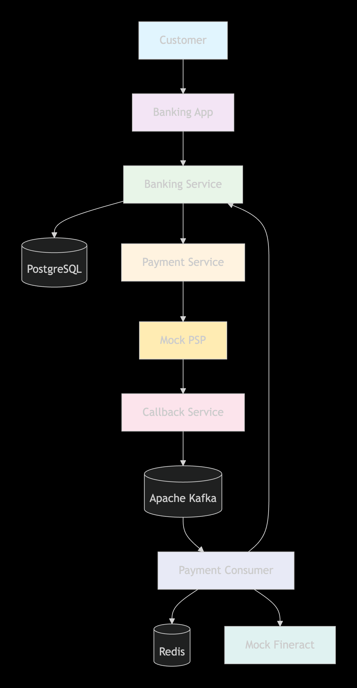
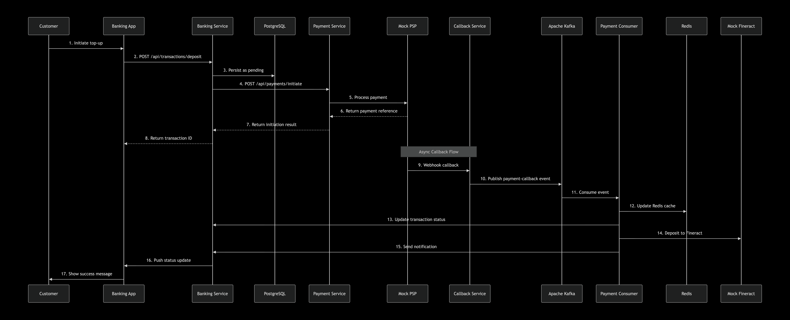

# **🏦 Payment Processing Microservices System**

A production-ready, event-driven payment processing system built with Spring Boot microservices. This project demonstrates real-world financial system patterns including payment initiation, PSP integration, webhook callbacks, Redis caching, and core banking system integration.
## **📋 Table of Contents**
- [Architecture Overview](#architecture-overview)
- [System Flow](#system-flow)
- [Tech Stack](#tech-stack)
- [Microservices](#microservices)

[//]: # (- [Getting Started]&#40;#getting-started&#41;)

[//]: # (- [API Endpoints]&#40;#api-endpoints&#41;)

[//]: # (- [Testing the Flow]&#40;#testing-the-flow&#41;)

[//]: # (- [Project Structure]&#40;#project-structure&#41;)

[//]: # (- [Future Enhancements]&#40;#future-enhancements&#41;)

[//]: # (- [Contributing]&#40;#contributing&#41;)

[//]: # (- [License]&#40;#license&#41;)

# 🏗️ Architecture Overview
## High-Level Architecture Diagram

## Sequence Diagram: Customer Funds Top-Up

# 🔄 System Flow
1. **Payment Initiation**: A customer initiates a top-up request via the Banking App.
2. **Transaction Creation**: The Banking Service creates a pending transaction record in PostgreSQL.
3. **Payment Processing**: The Payment Service processes the transaction by interacting with a Mock Payment Service Provider (PSP).
4. **Async Callback Handling**: The Mock PSP sends an asynchronous webhook callback to the Callback Service upon payment completion.
5. **Event Publishing**: The Callback Service publishes a Kafka event indicating the payment status.
6. **Event Processing**: The Payment Consumer listens for Kafka events and processes the payment status update.
7. **Cache Update**: The Payment Consumer updates the Redis cache to reflect the real-time status of the transaction.
8. **Database Update**: The Payment Consumer updates the transaction status in PostgreSQL.
9. **Banking Integration**: The Banking Service deposits the funds into the customer's Mock Fineract account.
10. **Notification**: The customer is notified of the successful top-up via the Banking App.

# 🛠️ Tech Stack
- **Backend**: Spring Boot, Spring Data JPA, Spring Kafka
- **Database**: PostgreSQL
- **Caching**: Redis
- **Messaging**: Apache Kafka
- **Mock Services**: Mock Payment Service Provider, Mock Fineract Core Banking System
- **Build Tool**: Maven

[//]: # (- **Containerization**: Docker &#40;for local development and testing&#41;)